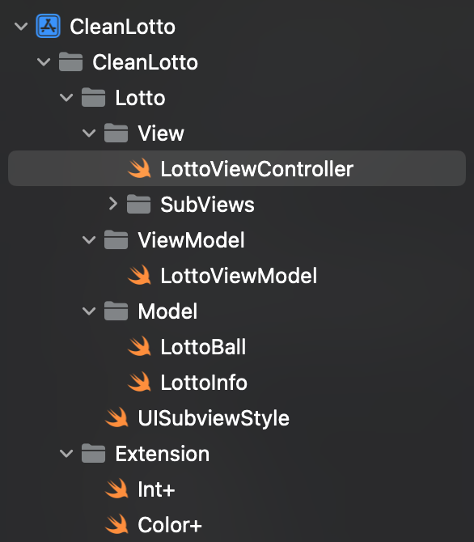
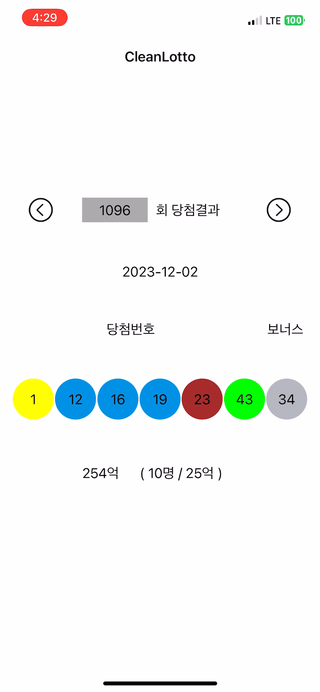

# 🚿 cleancode_lotto

# 로또 번호 조회

## 과제 설명

이 과제는 회차에 따른 로또 번호와 당첨 금액을 조회하는 과제입니다.
클린 코드를 활용해 작성해보세요.

## 기능

* 회차 선택
* 날짜 조회
* 로또 번호 조회
* 당첨 금액 조회

## 기술

* Swift
* Xcode

## 개발 일정

* 2023년 12월 4일 ~ 2023년 12월 11일

## 추가 고려사항

* 기능만 만족한다면, UI는 자유롭게!
* 언어나 프레임워크는 자유롭게!
* 아키텍처도 자유롭게!
* README도 작성하면 좋을 것 같아요!

### API

* http://www.dhlottery.co.kr/common.do?method=getLottoNumber&drwNo=\(num)

- - -

## 구현사항

* 기능 설명

    - 초기 화면 : 1096회 당첨결과 보여줌
    - 왼쪽, 오른쪽 버튼 클릭 시, 각각 이전, 이후 회차 당첨결과 및 정보 보여줌
    - 회차 번호는 TextField 형태로 키보드 입력 가능

* 구조

 

* 구현 미리보기

 
